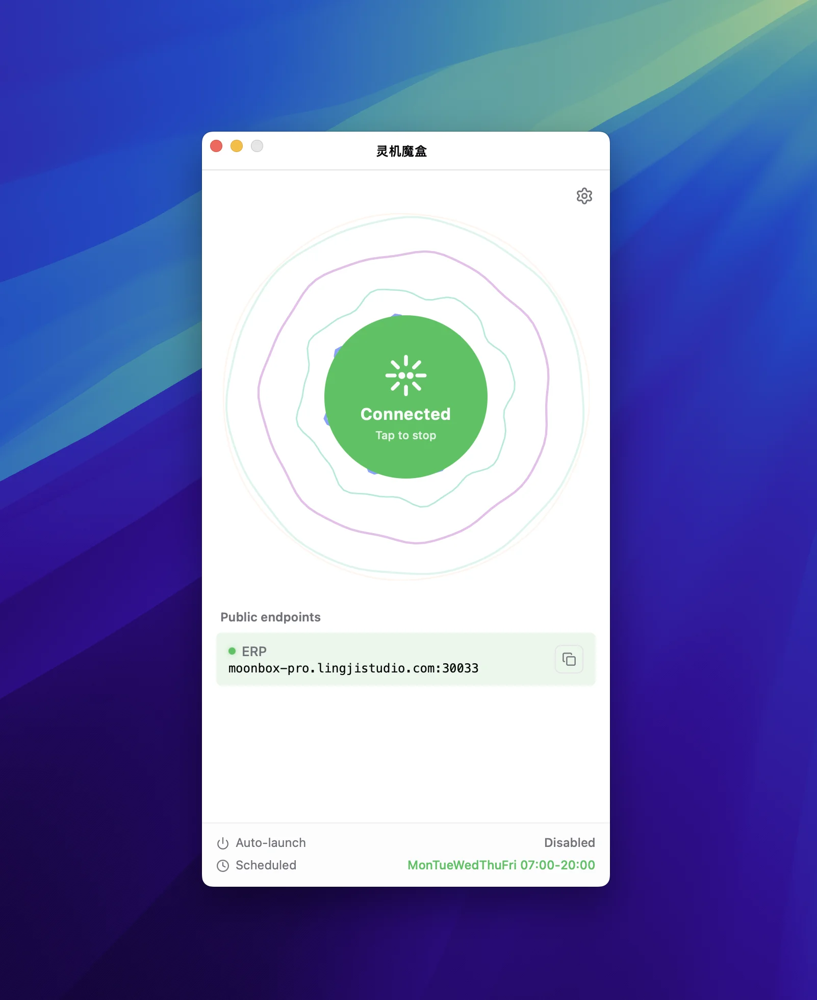

# MoonProxy

> A cross-platform **FRP desktop client** for non-technical users. Built with [Tauri v2](https://tauri.app), runs on macOS and Windows — turns [frp](https://github.com/fatedier/frp) reverse-proxy / NAT-traversal into a one-click experience.

[](./LICENSE)
[](https://github.com/MoonProxyHQ/moonproxy-desktop/stargazers)
[](https://github.com/MoonProxyHQ/moonproxy-desktop/forks)
[](https://github.com/MoonProxyHQ/moonproxy-desktop/releases)
[](https://github.com/MoonProxyHQ/moonproxy-desktop/actions/workflows/ci.yml)
[](https://github.com/MoonProxyHQ/moonproxy-desktop/actions/workflows/release.yml)
[](https://github.com/MoonProxyHQ/moonproxy-desktop/releases)
[](#install)
[](https://github.com/fatedier/frp)
[](https://tauri.app)

<a href="https://github.com/MoonProxyHQ/moonproxy-desktop/releases/latest"></a>&nbsp;<a href="https://github.com/MoonProxyHQ/moonproxy-desktop/releases/latest"></a>

<br/>

<a href="https://github.com/MoonProxyHQ/moonproxy-desktop/releases/latest"></a>&nbsp;<a href="https://github.com/MoonProxyHQ/moonproxy-desktop/releases/latest"></a>&nbsp;<a href="https://github.com/MoonProxyHQ/moonproxy-desktop/releases/latest"></a>


**[简体中文](./README.md)** · English

---



A friendly **desktop GUI for [frp](https://github.com/fatedier/frp)** — the reverse-proxy / NAT-traversal tool.
You bring your own frps server (self-hosted or any community frps you trust) — MoonProxy
takes care of the rest: configuration, lifecycle, connection health, auto-update,
and a polished tray-resident experience.

No CLI, no hand-edited `frpc.toml`, no manual process management — purpose-built for
**individual developers, self-hosters, and remote workers** who want frp without the terminal.

## Highlights

### 🚀 Getting Started — zero config, out of the box

- **Bundled frpc sidecar** — users never need to install frp separately.
- **Visual proxy management** — TCP / UDP / HTTP / HTTPS rules in a single tab.
- **One-click start/stop** — a circular button reflects 4 states
  (stopped / connecting / connected / error); the connected state is derived
  from real frpc evidence, not optimistic flags.

### ⚙️ Running — stable, resident, hassle-free

- **Live endpoint health** — local port reachability is polled every 3s so you
  catch broken tunnels before they bite you.
- **System tray resident** — closing the window hides to tray while frpc keeps
  running in the background.
- **Launch at login + silent start** — auto-launch can hide straight to tray.
- **Scheduled connect** — pick weekdays and start/stop times; hot-reloaded
  each minute by the scheduler.

### 🔧 Maintenance — auto-upgraded, no reinstall

- **Engine self-update** — frpc is fetched from upstream GitHub releases,
  SHA256-verified, then atomically swapped without reinstalling the app.
- **App self-update** — built on `tauri-plugin-updater`.


## Use Cases

Built for work — great for play:

- **Remote work** — SSH / RDP into office machines behind NAT, without the VPN hassle.
- **Self-hosted services** — temporarily expose NAS, Home Assistant, home media, or a personal blog.
- **Dev & webhook debugging** — expose local ports for Webhook / OAuth / third-party callbacks.
- **Team tooling** — share a local service with colleagues without a public IP or cloud VM.
- **More** — Minecraft sessions with friends, Webhook callbacks, anything else you need to expose.

## Relationship to frp

[MoonProxy](https://github.com/MoonProxyHQ/moonproxy-desktop) is an **unofficial** desktop GUI client
for [fatedier/frp](https://github.com/fatedier/frp) and is independent from the frp project.

- **frp** is the open-source reverse-proxy / NAT-traversal project maintained by fatedier.
- **MoonProxy** does not modify frpc behavior — it handles **configuration generation,
  subprocess lifecycle, and connection-state visualization** only.
- The frpc binary (v0.69.1) is bundled via Tauri's sidecar mechanism; users never install frp separately.
- The frpc engine can auto-update from upstream frp GitHub releases, with atomic swap.

> In short: **frp provides the capability, MoonProxy provides the usability.**

## FAQ

### What is MoonProxy?

MoonProxy (Chinese name: **月神代理**) is a cross-platform **FRP (Fast Reverse Proxy) tunnel desktop client**
for non-technical users, built on [Tauri v2](https://tauri.app). It wraps frpc command-line complexity —
config files, process management, health checks — into a graphical interface.

### Which platforms does it support?

macOS (Apple Silicon `aarch64` and Intel `x64`) and Windows (`x64`). Installers are published on
[GitHub Releases](https://github.com/MoonProxyHQ/moonproxy-desktop/releases) as DMG (macOS) and EXE (Windows).

### Do I need to install frp separately?

No. MoonProxy bundles the frpc binary (currently v0.69.1) via [Tauri's sidecar mechanism](https://tauri.app) — it works out of the box.

### Is MoonProxy open source?

Yes. MoonProxy is released under the MIT license, with source code and release cadence published on GitHub at [`MoonProxyHQ/moonproxy-desktop`](https://github.com/MoonProxyHQ/moonproxy-desktop).

### What does it add over the raw frp CLI?

Visual proxy rule management, a 4-state circular start/stop button, endpoint health polling (every 3s),
system tray residency, launch-at-login with silent start, scheduled connect (by weekday and time window),
automatic frpc engine updates from upstream GitHub Releases (SHA256-verified, atomic swap), and app self-updates.

### Can I use it without an frps server?

MoonProxy only manages the frpc client side — you must supply your own frps server. Common options:
① self-host a machine with a public IP (a 1 vCPU / 2GB cloud VPS is enough); ② use a community-public frps node
(evaluate trust and security yourself); ③ deploy a lightweight frps on serverless / cloud functions.

### Is the traffic exposed via MoonProxy secure?

Security is provided by the frp protocol itself: communication uses TCP/TLS or KCP encryption, and authentication tokens are held by you. MoonProxy does not store or relay your application data — configs and tokens live only on your machine.
Best practices: ① use a strong per-rule token; ② enable TLS encryption in `frpc.toml` (`transport.tls.force = true`); ③ enable the `allowUsers` whitelist on frps; ④ restrict exposed ports on the public side with a firewall.

### How does MoonProxy differ from ZeroTier / Tailscale?

They cover different needs. ZeroTier / Tailscale are full-device mesh VPNs that pull all traffic into a virtual LAN;
frp (what MoonProxy manages) is an on-demand reverse proxy that exposes a single local port to the public internet.
Want to RDP/SSH into every home machine → pick ZeroTier/Tailscale; just want to temporarily expose a NAS, blog, or
Webhook callback → pick frp + MoonProxy. The two can coexist.

## Keywords

FRP tunnel · frpc · frps · reverse proxy · NAT traversal · intranet penetration · desktop client · Tauri v2 · Rust ·
Vue 3 · TypeScript · macOS · Windows · Apple Silicon · cross-platform desktop app · MIT open source · MoonProxy · MoonProxyHQ

## Install

Pre-built binaries are published on the
[GitHub Releases page](https://github.com/MoonProxyHQ/moonproxy-desktop/releases).

| Platform | Download |
| --- | --- |
| macOS (Apple Silicon) | `MoonProxy_<version>_aarch64.dmg` |
| macOS (Intel) | `MoonProxy_<version>_x64.dmg` |
| Windows (x64) | `MoonProxy_<version>_x64-setup.exe` |

> **macOS first-launch note:** the app is ad-hoc signed but **not** notarized
> (no Apple Developer certificate). On first launch, right-click the app →
> **Open** → confirm in the dialog. Alternatively, after dragging to
> `/Applications`, run `xattr -cr "/Applications/月神代理.app"` to drop
> the quarantine attribute.

## Build from source

```bash
pnpm install
pnpm sync:frpc        # download frpc sidecar binaries
pnpm tauri dev        # local dev
pnpm tauri build      # production build for current platform
```

> Requires Node.js, pnpm, Rust toolchain, and platform-specific build tools.
> See [CONTRIBUTING.md](./CONTRIBUTING.md) for details.

## Resources

| Resource | Link |
| --- | --- |
| 🌐 Official homepage | <https://moonproxy.app> |
| 📦 Download installers | [GitHub Releases](https://github.com/MoonProxyHQ/moonproxy-desktop/releases) |
| 📖 Contributing guide | [CONTRIBUTING.md](./CONTRIBUTING.md) |
| 💬 Issues & discussions | [GitHub Issues](https://github.com/MoonProxyHQ/moonproxy-desktop/issues) · [Discussions](https://github.com/MoonProxyHQ/moonproxy-desktop/discussions) |
| 🛠 Dev collaboration doc | [AGENTS.md](./AGENTS.md) |

## License

[MIT](./LICENSE).

---

> This project is independent from [fatedier/frp](https://github.com/fatedier/frp).
> frp's releases and licensing remain with the upstream project;
> MoonProxy is a desktop client only.
