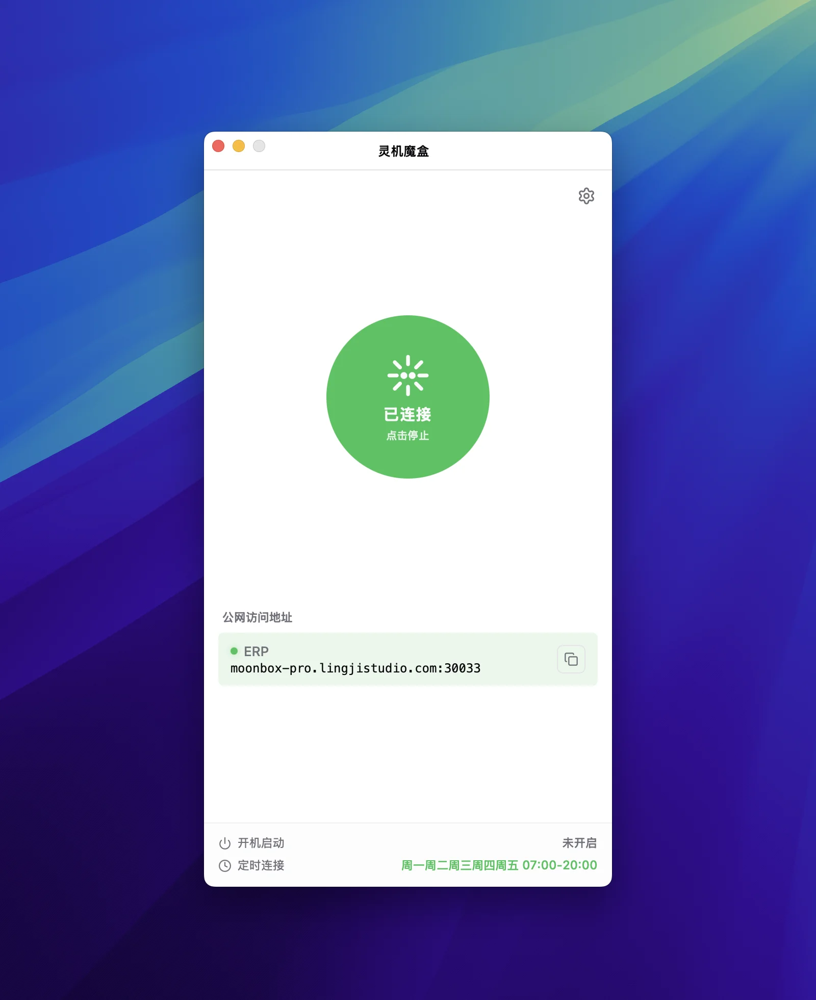

# Moonbox Desktop

> 跨平台、面向非技术用户的 **FRP 桌面客户端**。基于 [Tauri v2](https://tauri.app) 构建，支持 macOS 与 Windows，让 [frp](https://github.com/fatedier/frp) 内网穿透开箱即用。

[](./LICENSE)
[](https://github.com/lingjistudio/moonbox-desktop/actions/workflows/ci.yml)
[](https://github.com/lingjistudio/moonbox-desktop/actions/workflows/release.yml)
[](https://github.com/lingjistudio/moonbox-desktop/releases)
[](#下载)
[](https://github.com/fatedier/frp)
[](https://tauri.app)

[English](./README.en.md) · **简体中文**

---



面向非技术用户的 **[frp](https://github.com/fatedier/frp) 桌面 GUI 客户端**。
你只需要提供一台运行了 frps 的服务器（自建或社区公开均可），剩下的交给 Moonbox Desktop：
配置生成、子进程生命周期、连接健康检查、自动更新、托盘常驻等开箱即用。

不需要命令行、不需要编辑 `frpc.toml`、不需要手动管理 frpc 进程——
适合**个人开发者、自建服务玩家、远程办公者**以及所有不想和终端打交道的 frp 用户。

## 核心特性

- **可视化管理代理规则**：TCP / UDP / HTTP / HTTPS 一面板搞定，主页实时显示本地端口连通性
- **一键启停 frpc**：圆形大按钮分 4 态（已停止 / 连接中 / 已连接 / 连接错误），「已连接」由 frpc 自身证据支撑而非乐观标记
- **端点健康轮询**：每 3 秒探测一次本地端口可达性，提前发现隧道断裂
- **系统托盘常驻**：关闭窗口默认隐藏到托盘，frpc 继续后台运行
- **开机启动 + 静默启动**：自启时直接隐藏到托盘，不打扰用户
- **定时连接**：按星期多选 + 起止时间，调度器每分钟热加载
- **核心引擎自更新**：从 frp 上游 GitHub Release 拉取 frpc，SHA256 校验后原子替换，无需重装应用
- **应用本体自更新**：基于 `tauri-plugin-updater` 的「重启并安装」
- **内置 frpc 二进制**：通过 Tauri sidecar 机制打包，用户无需单独安装 frp

## 适用场景

- **远程办公**：在家通过 SSH / RDP 连接到公司内网机器，绕开 VPN 的繁琐
- **自建服务公网访问**：NAS、Home Assistant、家庭影音、个人博客的临时对外
- **开发联调**：本地端口临时暴露给 Webhook 回调、OAuth 回调、第三方联调
- **团队内部工具**：把本地服务临时共享给同事，无需公网 IP 或云服务器
- **游戏联机**：Minecraft 等联机服务临时对朋友开放

## 与 frp 的关系

[Moonbox Desktop](https://github.com/lingjistudio/moonbox-desktop) 是 [fatedier/frp](https://github.com/fatedier/frp) 的**非官方**桌面 GUI 客户端，与 frp 项目相互独立。

- **frp** 是 fatedier 维护的开源反向代理 / 内网穿透项目（以下简称为「frp」）
- **Moonbox Desktop** 不修改 frpc 行为，只做**配置生成、子进程生命周期管理、连接状态可视化**
- frpc 二进制（v0.69.1）通过 Tauri sidecar 机制打包，无需用户单独安装
- frpc 引擎可由应用内自动从 frp 上游 Release 拉取并原子升级

> 简言之：**frp 提供「能力」，Moonbox Desktop 提供「易用性」。**

## 下载

预构建包发布在 [GitHub Releases](https://github.com/lingjistudio/moonbox-desktop/releases)。

| 平台 | 文件 |
| --- | --- |
| macOS (Apple Silicon) | `Moonbox-Desktop_<version>_aarch64.dmg` |
| macOS (Intel) | `Moonbox-Desktop_<version>_x64.dmg` |
| Windows (x64) | `Moonbox-Desktop_<version>_x64-setup.exe` |

> **macOS 首次打开提示**：本应用为 ad-hoc 签名，**未做 Apple 公证**（无 Apple Developer 证书）。
> 首次打开请右键点击应用 → **打开** → 在弹出对话框中点 **打开**；
> 或将应用拖入 `/Applications` 后执行 `xattr -cr "/Applications/Moonbox Desktop.app"`
> 去掉隔离属性。Intel Mac 可直接双击运行。

## 从源码构建

```bash
pnpm install
pnpm sync:frpc        # 下载 frpc 二进制
pnpm tauri dev        # 本地开发联调
pnpm tauri build      # 当前平台打包
```

> 依赖：Node.js、pnpm、Rust 工具链、各平台构建工具链。详见 [CONTRIBUTING.md](./CONTRIBUTING.md)。

## 许可证

[MIT](./LICENSE)。

---

> 本项目与 [fatedier/frp](https://github.com/fatedier/frp) 项目相互独立，
> frp 的发布与许可归原项目所有；Moonbox Desktop 仅作为其桌面客户端。
